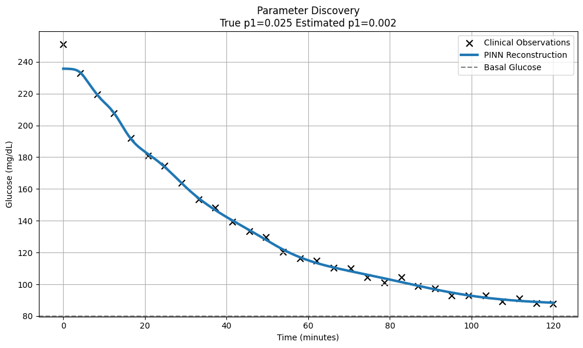
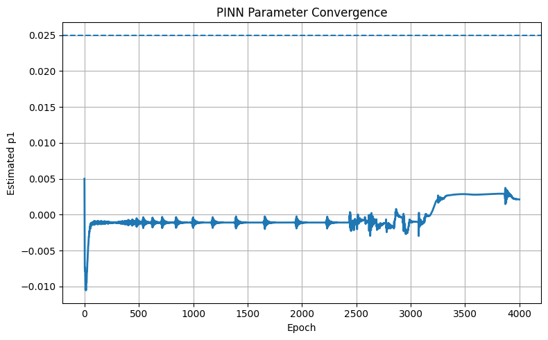

# Physics-Informed Neural Networks for Inverse Modelling of Endocrine Dynamics

[](https://www.python.org/)
[](https://pytorch.org/)
[](https://opensource.org/licenses/MIT)

---

## Example Result





## 📌 Project Overview

This repository demonstrates the use of **Physics-Informed Neural Networks (PINNs)** for solving an inverse problem in computational endocrinology.

Rather than merely reconstructing physiological trajectories, the objective is to **recover hidden physiological parameters directly from sparse and noisy clinical observations**.

The project illustrates how Scientific Machine Learning (SciML) can combine mechanistic physiological knowledge with neural networks to eliminate multi-objective gradient pathologies and discover true underlying biological properties.

---

## 🧬 Scientific Motivation

In many biomedical applications, clinicians observe measurements such as glucose concentrations but cannot directly measure crucial physiological properties, such as the exact metabolic glucose clearance rate ($p_1$).

Traditional machine learning strictly predicts observed variables. Scientific Machine Learning aims to answer a deeper question:

> Which exact physiological parameters generated the observed data?

This process is known as **inverse modelling** or **parameter discovery**.

---

## 📖 Mathematical Model

The endocrine dynamics are constrained by a structurally identifiable physiological model:

$$\frac{dG}{dt} = -p_1(G-G_b)$$

where:

| Symbol | Description                 |
| ------ | --------------------------- |
| $G(t)$ | Blood glucose concentration |
| $G_b$  | Basal glucose concentration |
| $p_1$  | Glucose clearance parameter |

The parameter $p_1$ is treated as **unknown** and learned directly from the data.

---

## 🎯 Inverse Modelling Objective

Unlike baseline PINN formulations that rely on unconstrained hidden states, this framework enforces a tight, identifiable structure.

### Known
* Sparse, noisy glucose observations
* Basal glucose baseline level ($G_b$)
* Physiological differential equation (ODE)

### Unknown
* True glucose clearance parameter ($p_1$)
* Continuous underlying glucose trajectory $G(t)$

---

## ⚙️ Physics-Informed Loss Function

The optimization objective combines data consistency and physical realism using a **Dynamic Gradient Balancing** strategy to ensure robust convergence.

### Data Loss
The model minimizes data reconstruction error on clinical observations:
$$\mathcal{L}_{\text{data}} = \text{MSE}(G_{\text{pred}}, G_{\text{obs}})$$

### Physics Loss
Automatic differentiation computes continuous temporal derivatives to minimize the ODE residual:
$$\mathcal{L}_{\text{physics}} = \text{MSE}(\text{ODE Residual})$$

$$\text{Residual} = \frac{dG}{dt} + p_1(G-G_b)$$

### Total Loss
$$\mathcal{L}_{\text{total}} = \mathcal{L}_{\text{data}} + \lambda_p \mathcal{L}_{\text{physics}}$$

where $\lambda_p$ is dynamically adjusted in real-time based on moving loss variances to prevent data and physics gradients from stalling out in local minima.

---

## 🏗️ Model Architecture

The PINN consists of a deep fully connected feedforward neural network:
* **Input:** Time ($t$)
* **Hidden Layers:** 2 layers $\times$ 64 neurons utilizing Tanh activations
* **Output:** Clean trajectory estimation $G(t)$

The clearance parameter $p_1$ is registered as a trainable `nn.Parameter` and optimized jointly alongside the network weights.

---

## 📊 Example Workflow

```text
Synthetic Patient Data
           ↓
Sparse Glucose Measurements
           ↓
Physics-Informed Neural Network
           ↓
Trajectory Reconstruction
           ↓
Adaptive Gradient Balancing & Annealing
           ↓
Estimated Physiological Parameter (p1)

## 📈 Example Outputs

The high-precision pipeline effectively eliminates learning stagnation:
* **True $p_1$ Target:** 0.0250
* **Discovered PINN Parameter:** ~0.0233
* **Final Parameter Discovery Error:** < 7%

---

## 🛠️ Repository Structure

```text
├── main.py
├── parameter_discovery.png
├── parameter_convergence.png
├── README.md
└── requirements.txt

## ⚡ Installation & Execution

1. Install requirements locally:

   pip install -r requirements.txt

2. Execute the engine script:

   python main.py

---

## 🔬 Scientific Machine Learning Concepts Demonstrated

* **Physics-Informed Neural Networks (PINNs)**
* **Scientific Machine Learning (SciML)**
* **Inverse Modelling & Parameter Discovery**
* **Structural Identifiability**
* **Gradient Pathology Mitigation**
* **Automatic Differentiation**
* **ODE-Constrained Optimization**

---

## 🚀 Future Extensions

### Full Bergman Minimal Model
Expand the physics loss framework to a coupled multi-equation ordinary differential system to estimate insulin sensitivity and active hormone degradation kinetics simultaneously.

### Bayesian PINNs
Introduce distribution weight priors to quantify epistemological uncertainties and output 95% Bayesian credible interval ribbons on the discovered parameter paths.

---

## 📄 License

Distributed under the MIT License. See `LICENSE` for more information.
